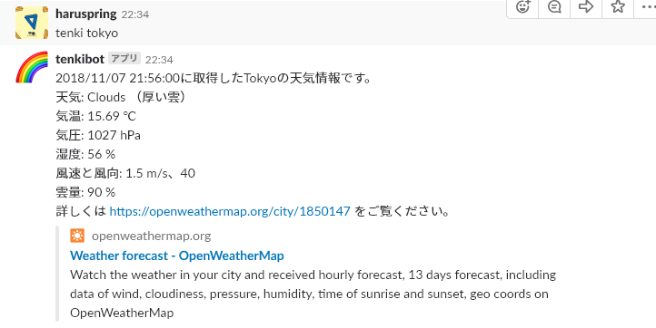
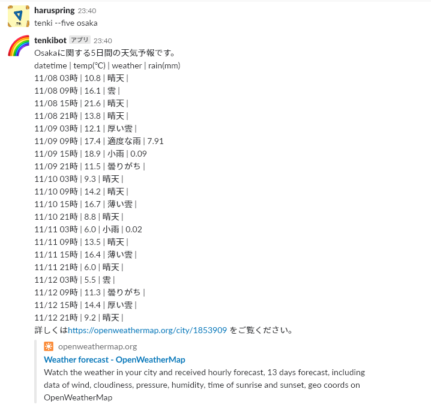
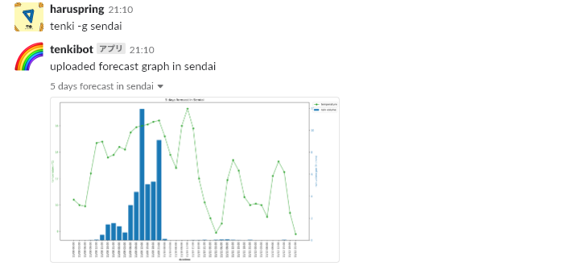
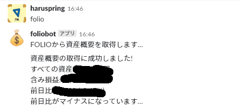

<!-- TOC -->

- [1. about](#1-about)
- [2. 使用している技術](#2-%E4%BD%BF%E7%94%A8%E3%81%97%E3%81%A6%E3%81%84%E3%82%8B%E6%8A%80%E8%A1%93)
    - [2.1. Python](#21-python)
    - [2.2. Slackbotフレームワーク](#22-slackbot%E3%83%95%E3%83%AC%E3%83%BC%E3%83%A0%E3%83%AF%E3%83%BC%E3%82%AF)
    - [2.3. ライブラリ](#23-%E3%83%A9%E3%82%A4%E3%83%96%E3%83%A9%E3%83%AA)
    - [2.4. Heroku](#24-heroku)
        - [2.4.1. buildpack](#241-buildpack)
        - [2.4.2. addon](#242-addon)
    - [2.5. 機能](#25-%E6%A9%9F%E8%83%BD)
        - [2.5.1. 天気情報に関する機能](#251-%E5%A4%A9%E6%B0%97%E6%83%85%E5%A0%B1%E3%81%AB%E9%96%A2%E3%81%99%E3%82%8B%E6%A9%9F%E8%83%BD)
            - [2.5.1.1. 使用できるコマンド](#2511-%E4%BD%BF%E7%94%A8%E3%81%A7%E3%81%8D%E3%82%8B%E3%82%B3%E3%83%9E%E3%83%B3%E3%83%89)
            - [2.5.1.2. 都市名について](#2512-%E9%83%BD%E5%B8%82%E5%90%8D%E3%81%AB%E3%81%A4%E3%81%84%E3%81%A6)
        - [2.5.2. お金に関する機能](#252-%E3%81%8A%E9%87%91%E3%81%AB%E9%96%A2%E3%81%99%E3%82%8B%E6%A9%9F%E8%83%BD)
            - [2.5.2.1. コマンド](#2521-%E3%82%B3%E3%83%9E%E3%83%B3%E3%83%89)
- [3. 利用方法](#3-%E5%88%A9%E7%94%A8%E6%96%B9%E6%B3%95)

<!-- /TOC -->

# 1. about

受け取ったメッセージに従って天気の情報をはじめ作者が欲しい情報を表示・通知してくれるslackbotです。

# 2. 使用している技術

## 2.1. Python

```bash
python-3.7.0
```

## 2.2. Slackbotフレームワーク

- [slackbot](https://github.com/lins05/slackbot)
    - メッセージの受け取り、サービスへのディスパッチに使用
- [python-slackclient](https://github.com/slackapi/python-slackclient)
    - botからのメッセージ送信、画像のアップロードなどに使用

## 2.3. ライブラリ

```bash
astroid==2.0.4
certifi==2018.10.15
chardet==3.0.4
colorama==0.4.0
cycler==0.10.0
idna==2.7
isort==4.3.4
kiwisolver==1.0.1
lazy-object-proxy==1.3.1
matplotlib==3.0.1
mccabe==0.6.1
numpy==1.15.3
pylint==2.1.1
pyparsing==2.3.0
python-dateutil==2.7.5
requests==2.20.0
selenium==3.141.0
six==1.11.0
slackbot==0.5.3
slackclient==1.3.0
slacker==0.9.65
urllib3==1.24
websocket-client==0.44.0
wrapt==1.10.11
yapf==0.24.0
```

## 2.4. Heroku

### 2.4.1. buildpack

以下のbuildpackを使用しています。

- heroku/python
- https://github.com/heroku/heroku-buildpack-google-chrome.git
- https://github.com/heroku/heroku-buildpack-chromedriver.git

### 2.4.2. addon

- Heroku Scheduler Standard
    - 定期的な通知をするために使用しています。

## 2.5. 機能

### 2.5.1. 天気情報に関する機能

#### 2.5.1.1. 使用できるコマンド

- `tenki <cityname（都市名）>`
    - その都市に関する現在の天気情報を表示します。`tenki -c <cityname（都市名）>`でもOKです。また、`-c`の代わりに`--current`を使用することもできます。
    - 
- `tenki [-5 | --five] <cityname（都市名）>`
    - その都市に関する5日間の天気情報を表示します。
    - 
- `tenki [-g | --graph] <cityname（都市名）>`
    - その都市に関する5日間の気温と降水量をグラフで表示します。
    - 

#### 2.5.1.2. 都市名について

天気情報は [OpenWeatherMap](https://openweathermap.org/)から取得しています。そのため、都市名はここに登録されている表記で入力する必要があります。ただし、`chiba`と`chiba-shi`はどちらも千葉市を取得してくれたりと様々なようです。

### 2.5.2. お金に関する機能

#### 2.5.2.1. コマンド

- `folio`
    - [FOLIO](https://folio-sec.com/)から資産状況を取得して通知してくれます。
    - 

# 3. 利用方法

現在のところ個人もしくは所属組織にて使用する目的で作成しているため、第三者による使用はできません。
