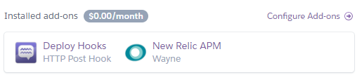
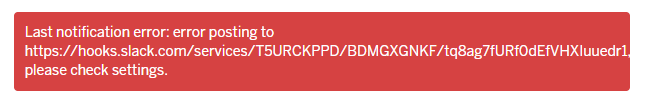
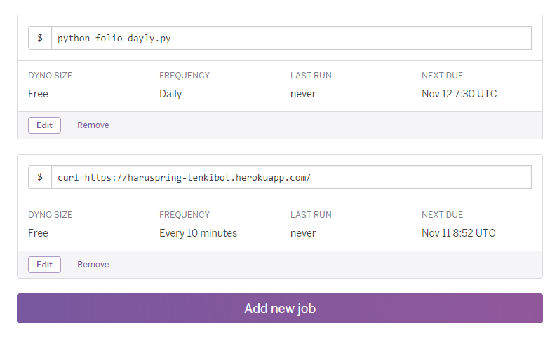

ハマり次第内容を追加予定。ブログのネタにしよう

# 参考リンク

- https://www.virtual-surfer.com/entry/2018/04/05/190000
    - だいたいの手順はここに準拠した
- https://www.virtual-surfer.com/entry/2018/06/07/190000
    - Herokuコマンド

# Heroku関係

## Heroku上のslackbot起動・停止


```bash
$ heroku ps:scale pbot=1
```

停止時は`1`を`0`に変更する。`pbot`は`Procfile`で定義しているプロセス名。

## ログを見る

```bash
heroku logs --tail
```

`--tail`でリアルタイム表示になる。

## 再起動

```bash
heroku restart
```

## sshログイン

```bash
heroku run bash
```

## Herokuに必要なファイル

以下をそれぞれルート直下に追加する。

- `Procfile`
- `requirements.txt`
    - `pip freeze`の出力を保存する
- `runtime.txt`
    - pythonのバージョンを保存する

## GutHubリポジトリとHerokuリポジトリの連携

https://j-hack.gitbooks.io/deploy-meteor-app-to-heroku/content/step4.html

だいたい以下の感じ

- Herokuのダッシュボード上でGitHubとの連携を設定
- GitHubへpushすることでHerokuでも自動でdeployされる

## pushをslackに通知する

- slackのAPPディレクトリ（https://harukawatips.slack.com/apps）から着信 Web フックを検索
- 設定を追加したら、Webhook URLをコピー
- 以下のXXXにコピーしたWebhook URLを貼り付ける

```bash
heroku addons:add deployhooks:http --url="XXXXXXXXXXXXXXXXXXXXXXXXXXXXXXXXX"
```

ターミナルからこれを送信して設定する

```bash
Creating deployhooks:http on ⬢ haruspring-tenkibot... free
Access the Deploy Hooks dashboard for this hook to finish setup.
Created deployhooks-spherical-65650
Use heroku addons:docs deployhooks to view documentation
```

追加されている。



slackにも追加通知が来る。


と思ってデプロイしたら通知が来なかった。悲しい。



よくわからないので一旦保留…

## Heroku Scheduler を使う

定期実行するためのアドオン。これを利用してSlackに定期的な通知を送ることができる。参考ページ: [【Heroku】無料プランの Sleep を回避する](https://www.shookuro.com/entry/2018/05/05/112133)

アドオンを追加する。GUI上でもできるはず。

```bash
heroku addons:create scheduler:standard
heroku addons:open scheduler
```

アドオンを`open`すると設定画面が表示されるので、実行するコマンドとスケジュールを入力する。



上のコマンドが定期実行用、下は`Sleep`を回避するためのコマンド。ただ、今はtenkibotのアプリケーショントップ画面を用意していないので、`503`エラーが返ってきてしまう。とはいえスリープを防げればいいのでOK。

# git関係

## マージ時に`fatal: refusing to merge unrelated histories`が表示された場合

```bash
$ git merge heroku/master --allow-unrelated-histories
```

これで強制的にマージする。このとき手動でマージする必要があるが、vscodeがわかりやすくて感動。

## リモート先の変更

### 現在のリモート先確認

```bash
git remote -v
```

### 向き先を変更

```bash
git remote set-url origin {new url}
```

## リモート追加

```bash
git remote add origin https://github.com/haruspring-jokt/tenkibot.git
```

## ブランチ関連

### ブランチの作成

```bash
$ git branch <branchname>
```

## リモートからpull

```bash
git pull origin master
```

### merge

developでの変更を取り込むために、まずmasterへ移動してからmergeする

```bash
$ git checkout master
Switched to branch 'master'
```

```bash
git merge issue1
```

### ブランチの削除

```bash
$ git branch -d issue1
Deleted branch issue1 (was b2b23c4).
```

# 環境変数

現在、以下のパラメータを環境変数で管理中（ローカルとHerokuともに）

メールアドレスとパスワードについては環境変数に置くのもアレ、またユーザが複数になった場合対応できないので、DBを用いて管理することが必要になってくると思う（この場合、DBへの情報登録などやることが多くなってくるんだけど...）。

- slackbotのトークン
- openWeatherMapのAPIキー
- chromeのバイナリー
- chromeのwebdriver（selenium用）
- FOLIOのメールアドレス
- FOLIOのパスワード

# slackbot

## 引数の指定

```python
@listen_to(r"^tenki\s([^-]+|-c\s[^-]+|--current\s[^-]+)$")
def respond_current_weather_data(message, something):
```

パラメータを`message`だけにするとパラメータが足りない！と言われたので、slackbotのマニュアルにあったとおり`something`を追加したら収まった。確認すると、`something`には1単語目以外が入っていた（`tenki`以外）。あんまりはっきりわかっていないので後で調べる。

# owm

## タイムゾーン

まだ取得したjsonの中身を見るに至っていないのだが、どうやらタイムゾーンが日本設定じゃないかも。
