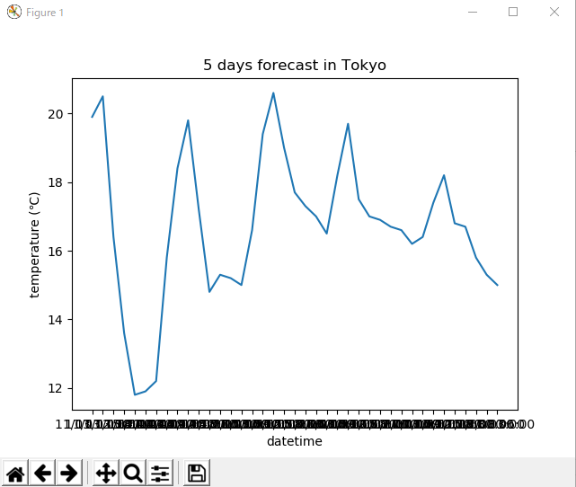

# 2018-11-03 作業メモ

今日のテーマはグラフグラフグラフmatplotlib

# メモ

## 目標

- OWMから取得してた天気予報を使ってグラフを作る
    - [x] 気温
    - [ ] 湿度
    - [ ] 降水確率
- グラフの中に天気情報を載せる
    - [ ] グラフの点にマークをつける感じ？
- 画像をSlackに投稿する
    - [x] 投稿したあとは削除する
    - [ ] Attachments形式なら画像とテキストをいい感じに混ぜられるかも

## 困っている点・やっておきたい

- 日にちのラベルをどうつけるか
    - 横書きだと収まらず文字が重なってしまう
- 凡例をつける
- 昼夜の違いがわかりにくい
- プロットごとにemojiで天気を表示したい
- 気温の幅がわかりにくい
    - デフォルトだと最大から最小で目いっぱいに広げてしまうため
    - 幅をどのように決めようか迷う
    - 極端なところを最大最小にするとグラフとしてみにくくなる
    - 極端な値を出したときにだけグラフの間隔を広げる？
- 他のグラフを追加する
    - 湿度、降水量

## まだ触れていない機能

- 定期投稿
    - 明日の予報を流す（寝る前くらい）
- ログ出力
    - ファイルへの保存も
- リファクタリング
    - グチャッとしてる
    - Slackトークン色々なところからとりすぎでは

### グラフの作成

昼時点でここまで。うーんダサい

### 画像の投稿

投稿には今までとは別のライブラリである`SlackClient`を使用する。`slackbot`はできることが限定されているので、ディスパッチ専用にしようかな…

